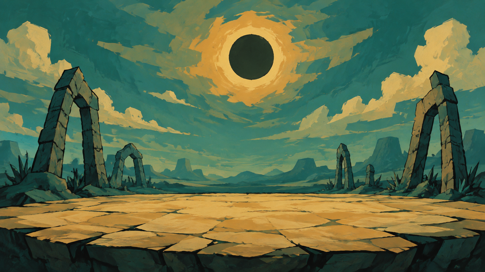

# Andrew the Spire

A small, surreal fantasy deckbuilder for landscape phones, built with Expo and React Native. Fight two sentries, choose a card, visit a mysterious well, and face the Bellkeeper beneath an eclipse.



## Play locally

Use Node.js 22.13 or newer and pnpm. Install an Expo Go version compatible with Expo SDK 57 on your iPhone or Android phone.

```sh
pnpm install --frozen-lockfile
pnpm start --lan
```

Scan the QR code with your phone. For LAN mode, keep the phone and computer on the same Wi-Fi. If your network blocks LAN connections, use `pnpm start --tunnel` instead. Keep the development server running while playing in Expo Go.

The app locks to landscape and hides the system status bar. Expo Go may show its own development controls. This repository includes the game and bundled assets; it does not include a signed App Store build.

## How to play

- Tap a card to inspect it; swipe or tap Hide to close.
- Drag an attack onto an enemy. Drag a block card onto the field.
- Spend your energy, read enemy intent, and end your turn.
- Win the first fight and choose one of three cards for your deck.
- Choose a gift at the well, then face the boss. Health carries between encounters.

The menu contains sound, restart, and help. Each scene has its own music with entry and exit fades. Hits have distinct sounds and tactile feedback. Artwork and audio are cached locally after the first load. Expo Go still needs its development server for the JavaScript application.

## Development

```sh
pnpm check
pnpm test
pnpm exec expo export --platform ios --platform android
```

The automated suite covers combat, the run and card rewards, phone layout, hit timing, and music fade behavior. Native builds can be exported on a desktop; visual, audio, and haptic feel should also be tested on a physical device.

Key files:

- `App.tsx` — scene flow and combat orchestration.
- `lib/battle.ts` — pure combat rules and card definitions.
- `lib/layout.ts` — landscape placement and target hit testing.
- `components/Card.tsx` — the arced, draggable hand.
- `components/Fighter.tsx` — sprite movement and combat animation.
- `lib/audio.tsx` and `lib/music-envelope.ts` — audio playback and fades.
- `scripts/render-rooms.py` — the current room scores.

The bundled art was created with AI image generation and layered animation. Several generation prompts are included alongside the images. Music arrangements and rendering scripts are original to this project; recorded instrument sources are documented in [THIRD-PARTY-NOTICES.md](THIRD-PARTY-NOTICES.md).

## License

The original game code, documentation, and project-authored artwork are available under the [MIT License](LICENSE). Third-party dependencies and audio sample material retain their own licenses. See [THIRD-PARTY-NOTICES.md](THIRD-PARTY-NOTICES.md) for the audio exceptions, attribution, and source materials.
